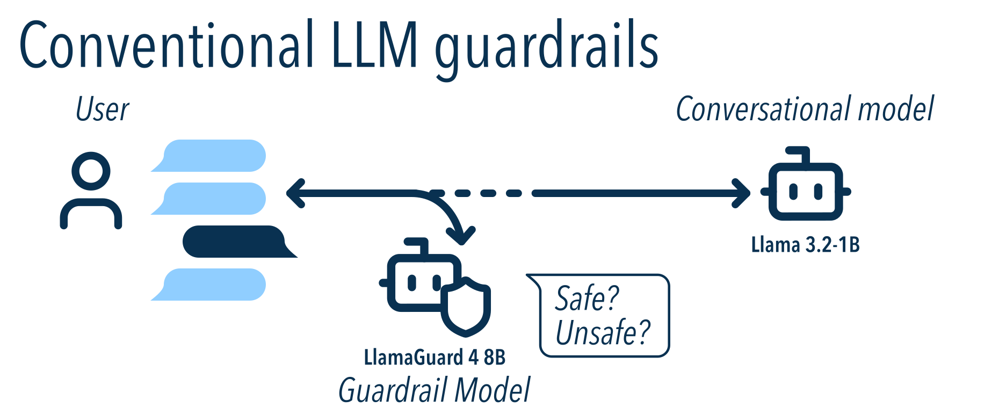
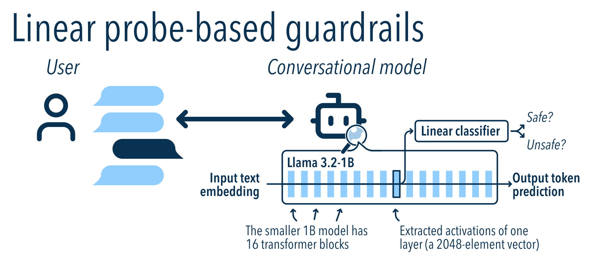
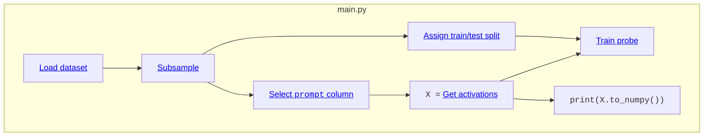
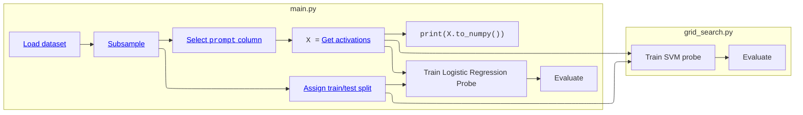
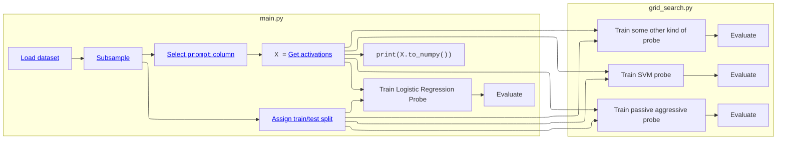

# Use `krnel-graph` to build custom guardrails by "reading the mind of the model"
- **Point of contact:** Kimmy Wilber `<kimmy@krnel.ai>` and Peyman Faratin `<peyman@krnel.ai>`, questions&comments welcome!
- **Date:** 2025 October
- **Intended audience of this guide** is twofold:
   1. Agent developers who want to build LLM applications,
   2. Mechanistic interpretability researchers who want a lightweight way of quickly running experiments.

---


## Introduction

*LLMs are hard to control!*
If you're building a tool that relies on LLMs or agents, how can you be sure that it won't [go off the rails?](https://www.npr.org/2025/07/09/nx-s1-5462609/grok-elon-musk-antisemitic-racist-content) How can you make sure your users' data [doesn't get hacked](https://www.cybersecuritydive.com/news/research-shows-ai-agents-are-highly-vulnerable-to-hijacking-attacks/757319/)?
Ensuring the safety of LLMs requires a novel approach, but right now, there are very few safety tools available to users who want to align the behavior of their models:
1. Rely on the **frontier LLM training labs** to do [safety alignment](https://openai.com/index/detecting-and-reducing-scheming-in-ai-models/) for you
2. Use a separate **guardrail model** like [LlamaGuard 4](https://github.com/meta-llama/PurpleLlama/tree/main/Llama-Guard4) from Meta, [LLM Guard](https://github.com/protectai/llm-guard) from ProtectAI, or [NemoGuard](https://huggingface.co/nvidia/llama-3.1-nemoguard-8b-content-safety) from NVIDIA.


### Conventional guardrails

Conventional guardrails involve a user and two separate LLM models: the *conversational model* that's having the conversation (like ChatGPT or Claude), and a *separate guardrail model* (like LlamaGuard) which views a copy of the conversation and decides whether each message is safe or unsafe. The guardrail model gets to control the conversation: Messages that are safe pass through, and messages that are unsafe are stopped or sanitized by the application.



In this case,
- The guardrail model **lives separately**, doubling GPU and infrastructure requirements. The latest version of LlamaGuard uses a 12B model, but Llama 3 comes in 1B and 8B variants.
- The guardrail model **adds latency**, because each message of the conversation needs to travel to two models. Running both models in parallel helps, but latency is still defined by the slowest model.
- The guardrail model is **hard to configure.** Typical guardrails are trained to classify [a fixed taxonomy of hazard categories](https://huggingface.co/meta-llama/Llama-Guard-4-12B#hazard-taxonomy-and-policy). If you want to add a different policy to the list, you can add it to its system prompt, but it hasn't been trained on your policy, so you need to measure that your changes help.
- The guardrail model **has a fixed sensitivity,** so you can't adjust the tradeoff between precision and recall. For example, if you want the model to give lower false alarms at the cost of allowing more objectionable content, there's no way to configure it to be less sensitive.

### A better approach: Linear probe-based guardrails

The field of mechanistic interpretability offers another approach: **What if we could read the mind of the model** and use that information to decide whether the conversation is safe?



To do this, we feed the conversation through the model as before to get an output token. However, while it's running, we capture the activations from the [residual stream](https://www.lesswrong.com/posts/utBXFnrDoWdF6cBxf/exploring-the-residual-stream-of-transformers-for), right after one of the layers. We then send this through a simple classifier, like a [support vector machine](https://scikit-learn.org/stable/modules/svm.html), a decision tree, or logistic regression.

This approach has a number of benefits:
- It's **flexible** and **accurate**, because you're training the guardrail yourself on your own data
- It **doesn't add latency** to your conversations and **doesn't add extra compute requirements** beyond the conversational model, because the classifier is lightweight and can run instantly on the CPU.

However, there are some tradeoffs:
- You need to pick which data to train on
- You need to collect activations for this dataset

Today, we'll build a custom linear probe-based guardrail using a custom dataset. Then, we'll compare its accuracy to LlamaGuard.
To keep track of our experiment, inputs, and outputs, we'll use the [`krnel-graph` library](https://github.com/krnel-ai/krnel-graph), which handles the LLM and modeling machinery while giving us automatic caching and data provenance.

This demonstration is an offline (batch) evaluation only. **For real-time monitoring**, including low-latency runtime integrations with Ollama, VLLM, HuggingFace, etc, give us a call at `info@krnel.ai`!

## Datasets

There are many datasets for AI safety and content policy.
We need datasets that are open-source, that include a contrasting mix of safe and unsafe examples, are similar to ordinary conversations / user requests.

Here are the datasets we will combine for this guide:

- [**Alpaca, from Tatsu Lab**](https://huggingface.co/datasets/tatsu-lab/alpaca), containing 52,000 safe prompts for various tasks
- [**BabelScape Alert** and **Alert-Advanced**](https://huggingface.co/datasets/Babelscape/ALERT), containing 45,000 unsafe prompts from a [taxonomy of categories](https://arxiv.org/abs/2404.08676) including hate speech, criminal planning, controlled substances, sexual content, self-harm, and weapons
- [**In-the-Wild Jailbreak Prompts from TrustAIRLab**](https://huggingface.co/datasets/TrustAIRLab/in-the-wild-jailbreak-prompts), a (somewhat noisy) containing >15,000 jailbreak and non-jailbreak prompts
- [**SorryBench**](https://huggingface.co/sorry-bench), with 9,400 unsafe prompts drawn from 44 fine-grained categories (2024 June version)
- [**SteeringToxic from Undi95**](https://huggingface.co/datasets/Undi95/orthogonal-activation-steering-TOXIC), which has 7,300 unsafe prompts
- [**AdvBench from WalledAI**](https://huggingface.co/datasets/walledai/AdvBench), with 520 harmful behaviors
- [**Many Shot Jailbreaking by Vulkan Kutal**](https://github.com/KutalVolkan/many-shot-jailbreaking-dataset/), with 266 jailbreaks
- [**GPTFUZZER from Jiahao Yu et al**](https://github.com/sherdencooper/GPTFuzz) with 100 unsafe prompts


### Set up your environment

Follow these steps on a Linux or macOS system. For Windows, you can use WSL or follow along in the native command line.

1. **Download and install `uv`** from [Astral's installation page](https://docs.astral.sh/uv/getting-started/installation/#installation-methods).
    - `uv` manages python versions, environments, and dependencies for you in self-contained isolated environments, so there's no risk of breaking your system.
    - You can use another python package manager like `pip` or `conda`, but you'll need to change all the examples. *We use uv for development.* If you use your own Python, make sure it is at least version 3.10.

2. **Make a new folder** for this project. You can either clone this repository and play in this example folder, or create a fresh workspace:
    ```shell
    $ cd /tmp
    $ mkdir guardrail_comparison
    $ cd guardrail_comparison
    $ uv init --name guardrail_comparison
    ```
    Install dependencies into this project folder:
    ```shell
    $ uv add krnel-graph[ml,viz] huggingface-hub jupyterlab duckdb pandas
    ```
    If you cloned this example repository, the dependencies are already in this folder's [`pyproject.toml`](./pyproject.toml).

3. **Log into your HuggingFace account** on the website and copy your [access token](https://huggingface.co/settings/tokens) into the HuggingFace CLI:
    ```shell
    $ uv run hf auth login
    ```

4. **Request access to [SorryBench](https://huggingface.co/datasets/sorry-bench/sorry-bench-202406) and [the Llama, Llama-2, and LlamaGuard models](https://huggingface.co/meta-llama/Llama-2-7b-chat-hf)**. If you want to run without waiting for approval, you can comment the relevant lines from `make_data.py`, but your results will differ somewhat from ours.

### Preparing the data

**Run our data preparation script** to download the data:
```shell
$ uv run make_data.py
```

This should only take 30 seconds or so.  You should see output like the following:

```
Downloading datasets... (takes ~30 sec)

Row counts:
Source                        Safe?  Expected     Actual
----------------------------------------------------------------------
GPTFuzz                           1       100        100 ✅ OK
advbench                          1       520        520 ✅ OK
babelscape_alert                  1     14092      14092 ✅ OK
babelscape_alert_adv              1     30771      30771 ✅ OK
jailbreak_llms                    0      9638       9638 ✅ OK
jailbreak_llms                    1     19738      19738 ✅ OK
many-shot-jailbreaking            1       266        266 ✅ OK
sorrybench                        1      9439       9439 ✅ OK
steering-toxic                    1      7377       7377 ✅ OK
tatsu-lab-alpaca                  0     52001      52001 ✅ OK
```

The resulting dataset should contain 143,942 rows from these 9 datasets.

<details>
<summary><strong>💣 Expand for troubleshooting steps</strong></summary>

- **Mismatches** can happen if the original data has changed since this guide was written. This can cause your results to differ from ours, but this isn't generally a large problem unless you're missing one of the larger datasets.

- **Unable to connect to URL**: If you see an error like `_duckdb.HTTPException: HTTP Error: Unable to connect to URL "hf://...": 401 (Unauthorized).`, you need to log in to HuggingFace with `uv run hf auth login`. You may also need to request access on HuggingFace if the dataset is gated.
If all else fails, comment out the relevant lines from `make_data.py` and run without those datasets.
</details>

## Gathering activations and training linear probes
We can run the LLM, collect activations, and train probes using the `krnel-graph` framework. To do this, start by instantiating a `Runner` object in a file called `main.py`:

```python
#!/usr/bin/env -S uv run
import krnel.graph as kg
runner = kg.Runner()
```
The dataset has three columns: a [text column](https://krnel-graph.readthedocs.io/en/latest/types.html#textcolumntype-quick-reference) called "prompt", a [boolean column](https://krnel-graph.readthedocs.io/en/latest/types.html#krnel.graph.types.BooleanColumnType) called "harmful" acting as our classification target, and a [categorical column](https://krnel-graph.readthedocs.io/en/latest/types.html#categoricalcolumntype-quick-reference) named "source" that captures which dataset the input came from.
```python
# Load the dataset from a local parquet file
ds = runner.from_parquet("dataset.parquet")
ds = ds.take(skip=10) # sample a tenth of the dataset

# Dataset columns
col_text    = ds.col_text("prompt")
col_harmful = ds.col_boolean("harmful")
col_source  = ds.col_categorical("source")

# Define a train/test split
col_split = ds.assign_train_test_split()
```
Columns can come from the dataset or can be an output from other operations. For example, `assign_train_test_split` creates a [`AssignTrainTestSplitOp`](https://krnel-graph.readthedocs.io/en/latest/mech-interp/index.html#krnel.graph.dataset_ops.AssignTrainTestSplitOp), which defaults to holding 25% of the data as a test split (see [docs](https://krnel-graph.readthedocs.io/en/latest/types.html#krnel.graph.types.DatasetType.assign_train_test_split)). If there were a train/test split column inside the data already, we could have used [`ds.col_train_test_split("split")`](https://krnel-graph.readthedocs.io/en/latest/types.html#krnel.graph.types.DatasetType.col_train_test_split) instead.

From there, we can extract the last layer activations of `Llama 2 7B-chat-hf` on each of these prompts and train a probe on the training set using logistic regression that attempts to predict the `harmful` label:
```python
# Extract activations
X = col_text.llm_layer_activations(
    model_name="hf:meta-llama/Llama-2-7b-chat-hf",
    layer_num=-1,      # last layer
    token_mode="last", # last token
    batch_size=4,      # tweak for your hardware
    max_length=2048,   # truncate prompts longer than this many tokens
    dtype="float16",
)

# Train a linear probe
probe = X.train_classifier(
    "logistic_regression",
    positives=col_harmful,        # classification target
    train_domain=col_split.train, # which samples to train on
    preprocessing="standardize",
    params={"C": 0.01},
)
```

Now, save the above in `main.py` and run it:
```shell
$ uv run main.py
```
and.... nothing happens! You've defined *what* steps to take, but you haven't actually *run* them yet.  To actually materialize the graph, we need to call `.to_numpy()` on the result we want, like this:
```python
if __name__ == "__main__":
    print("Activations:")
    print(X.to_numpy())
    print(X.to_numpy().shape)
```
This script should take about ten minutes to run on good hardware. Almost all of that time comes from running the Llama model itself. Afterwards, the output activations are printed to the console:
```
Activations:
[[-0.4116 -3.61    2.607  ... -2.186  -1.043   0.7437]
 [-0.1288  0.2725  1.552  ... -2.17   -0.1768  1.308 ]
 [ 0.9307  2.457   2.447  ... -0.7065  1.142  -1.782 ]
 ...
 [-0.2417  0.782   1.974  ... -2.82    1.614   1.17  ]
 [-0.2551  1.2705  1.208  ... -1.4795  0.374   0.9097]
 [-0.9517  0.0992  1.5    ... -1.579   1.707   1.213 ]]
(1440, 4096)
```

<details>
<summary><strong>💣 Expand for troubleshooting steps</strong></summary>

- **I get a "CUDA out of memory" error!**
    1. Try to lower `batch_size` to 1.
    2. Try a smaller model, like `"hf:meta-llama/Llama-3.2-1B-Instruct"`
- **It's taking forever!**
    1. Subsample the dataset. Change
       ```python
       ds = runner.from_parquet("dataset.parquet")
       ds = ds.take(skip=10)
       ```
       to
       ```python
       ds = runner.from_parquet("dataset.parquet")
       ds = ds.take(skip=100)
       ```
       This will sample 1/100th of the dataset.
    2. Check your GPU hardware.  If you run `nvidia-smi`, you should see GPU usage while the script is running. Llama2-7b requires a GPU with at least 20GB VRAM. You can also use a smaller model, like `"hf:meta-llama/Llama-3.2-1B-Instruct"`. We tested llama2-7b on:
        - a 32GB Apple Macbook Pro with Apple Silicon (M1 Max, ca. 2021) via the `mps` device
        - a GCP instance running Ubuntu with an NVIDIA A100 40GB via the `cuda` device
</details>


## Wait, what's `krnel-graph`?
Krnel-graph is a lightweight computation graph library for mechanistic interpretability researchers that makes it easy to fully specify experiments.

With `krnel-graph`, you write your code declaratively. The full content of `main.py`

```python
import krnel.graph as kg
runner = kg.Runner()

# Load the dataset from a local parquet file
ds = runner.from_parquet("dataset.parquet")
ds = ds.take(skip=10) # sample a tenth of the dataset

# Dataset columns
col_text    = ds.col_text("prompt")
col_harmful = ds.col_boolean("harmful")
# Assign train/test split
col_split   = ds.assign_train_test_split()

# Extract activations
X = col_text.llm_layer_activations(
    model_name="hf:meta-llama/Llama-2-7b-chat-hf",
    layer_num=-1,      # last layer
    token_mode="last", # last token
    batch_size=4,      # tweak for your hardware
    max_length=2048,   # truncate prompts longer than this many tokens
    dtype="float16",
)

# Train a linear probe
probe = X.train_classifier(
    "logistic_regression",
    positives=col_harmful,        # classification target
    train_domain=col_split.train, # which samples to train on
    preprocessing="standardize",
    params={"C": 0.01},
)

if __name__ == "__main__":
    print("Activations:")
    print(X.to_numpy())
```
This creates a computation graph that is lazily executed when you need it.

Using krnel-graph in this way requires a shift in thinking, but there are several advantages:
- **You get caching for free.** There were two calls to `X.to_numpy()`, but it only ran once. Each operation's cache key takes all of its inputs and parameters into account, so you can change parameters or architectures without worrying about overwriting results or using stale values.
- **Strongly-typed computation graphs catch more problems at import time and work better with your tooling** like agents, type inference, or editor autocompletion. Open `main.py` in VSCode and put the caret after `col_text.`, then press tab. You'll see the palette of operations you can perform on text columns.
- **No configuration or extra tools needed.** krnel-graph doesn't need to be configured and can run right in your notebook or laptop. You can (optionally) run `uv run krnel-graph config` to change where intermediate results get saved (S3, etc).
  - 👉 The defaults are lightweight, but `krnel-graph` is more than capable of integrating with your favorite dataflow orchestration library at cloud scale. See the [docs](https://krnel-graph.readthedocs.io) to get started.
- **It gently encourages best practices around experiment keeping.** The preferred pattern is to keep the main copy of your experiment in `main.py`. Derived experiments, grid searches, different models, and other graph substitutions can live in external files that `import main` .
    - *Suggested pattern:* Main experiment prototype/exemplar lives in `main.py`. Other experiments and derivatives live in other files and `import main` and build on top of parts of the existing graph using [`.subs()`](https://krnel-graph.readthedocs.io/en/latest/graph-specification.html#krnel.graph.op_spec.OpSpec.subs)
      - Imperative code in `main.py` should be guarded by `if __name__ == "__main__"`
      - *👉 Don't worry about output filenames like `layer_23_activations.final.2-DONOTUSE-final.parquet`*. Each output in the cache is keyed by a unique hash of the subgraph that generated that output, so knowing an operation's dependencies and parameters is necessary and sufficient to guarantee its uniqueness in the cache.
      - *👉 Team use*: If you have several researchers working in the same project, keep `main.py` in source control and use a shared cache location on S3. Now you can re-use other teammates' results without having to recompute them!
    - For an example of this pattern, see [`grid_search.py`](./grid_search.py) or [`additional_llamaguards.py`](./additional_llamaguards.py)
    - Notebooks benefit greatly from this `import main` pattern because the graph is lazily defined, so you can have a cluster of GPU machines execute the graph, then use a small notebook on your laptop to interactively view results or plan your next run.

## Evaluation
Our probe is based on a logistic regression classifier that outputs a confidence score (decision function) based on the neuron activations. To decide whether a prompt is safe or unsafe, this score must be thresholded. This leads to four possible outcomes:
- **Safe prompt, scoring lower than the threshold**: A true negative.
- **Safe prompt, scoring higher than the threshold**: A false positive. Mistakes like these cause ordinary conversations to be flagged. This hurts precision.
- **Unsafe prompt, scoring lower than the threshold**: A false negative. Mistakes like these cause the guardrail to miss unsafe conversations, hurting recall.
- **Unsafe prompt, scoring higher than the threshold**: A true positive. We stopped the bad guys!

How well does our probe perform on this data? To do this, we can compare the [logistic regression confidence scores](https://scikit-learn.org/stable/modules/generated/sklearn.linear_model.LogisticRegression.html#sklearn.linear_model.LogisticRegression.predict_proba) with the groundtruth labels, `col_harmful`. Krnel-graph contains built in evaluation operations for binary classification:
```python
# Evaluation (JSON report)
probe_result = probe.predict(X).evaluate(
    gt_positives=col_harmful,
    split=col_split,
    score_threshold=0.0,
)

if __name__ == "__main__":
    print("\n\nResults on TEST SET:")
    print(probe_result.to_json()['test'])
```
The result is a JSON report of test set metrics. We added some explanatory comments below:
```yaml
{
    # Number of samples (=143942 input * 0.1 subsample * 0.25 test set)
    "count": 3599,
    # Label distribution: number of unsafe (true) and safe (false) samples
    "n_true": 2049, "n_false": 1550,
    # The average score output by the classifier (logistic regression decision function, for smoketest)
    "avg_score": 0.6642874344722254,

    # Continuous metrics - AP and area under ROC curve.
    # (Doesn't depend on score_threshold)
    "average_precision": 0.999267973058908,
    "roc_auc": 0.9990280073678741,

    # Various accuracy metrics (unweighted, across entire test set)
    # (Only appears when score_threshold is set)
    "accuracy": 0.9877743817727146,
    "precision": 0.9873602333495382,
    "recall": 0.9912152269399708,
    "f1": 0.9892839746712129,

    # Confusion matrix at the given score threshold
    # predicted = negative    positive
    "confusion": {"tn": 1524, "fp": 26,     # gt = negative
                  "fn": 18,   "tp": 2031},  # gt = positive

    # Precision/recall curve
    "precision@0.1": 1.0,
    "precision@0.2": 1.0,
    "precision@0.3": 1.0,
    "precision@0.4": 1.0,
    "precision@0.5": 1.0,
    "precision@0.6": 1.0,
    "precision@0.7": 1.0,
    "precision@0.8": 0.9994404029099049,
    "precision@0.9": 0.9989711934156379,
    "precision@0.95": 0.9979654120040692,
    "precision@0.99": 0.9916911045943304,
    "precision@0.999": 0.9237364620938628
}
```

These numbers are somewhat noisy because the dataset is small. We have sampled 1/10th of the dataset and held out 25% of the remainder for testing, so the metrics are computed on `143942 * 0.1 * 0.25 = 3599` samples. To run across all data, remove the `ds = ds.take(skip=10)` line and rerun.

### Discussion: What metrics are worth considering?

- **Accuracy**: In the real world, most correspondents are fairly well-behaved. Unsafe prompts are fairly rare. A perfectly fine "guardrail" could simply always guess that the input is safe, and it will be correct around 99% of the time. In our case, we achieve an accuracy of 98.77%.

- **Confusion matrix**: This describes the number of true positives, false positives, true negatives, and false negatives. Confusion matrices can help us notice if the model is always predicting one way or the other. In this example, the model only falsely flags 26 safe prompts by accident and misses 18 unsafe prompts. This happens to roughly match the input label distribution.<table> <tr><th></th><th>Predicted safe</th><th>Predicted unsafe</th></tr> <tr><th>Groundtruth safe</th><td>1524</th><td>26</td></tr> <tr><th>Groundtruth unsafe</th><td>18</td><td>2031</td></tr> </table>

- **Precision @ k**: Suppose we set the score threshold to catch some fraction, `k`, of the unsafe prompts. At that threshold, which fraction of flagged prompts truly are unsafe?

Some metrics are only available because we set an output threshold (`score_threshold=0.0`). If you want to play with sensitivity tradeoffs, this is the knob to adjust.

Luckily, `krnel-graph` operations include a [`.subs()` method](https://krnel-graph.readthedocs.io/en/latest/graph-specification.html#krnel.graph.op_spec.OpSpec.subs) that makes it easy to create derivatives of a graph by changing certain parameters.  Save the following as `thresholds.py` and run with `uv run thresholds.py`:
```python
import pandas as pd
if __name__ == "__main__":
    # Print a table of accuracies at different score thresholds
    df = []
    for threshold in [-10.0, -5.0, -1.0, -0.5, 0.0, 0.5, 1.0, 5.0, 10.0]:
        # Make a new graph by substituting a different threshold
        new_eval = probe_result.subs(score_threshold=threshold)
        result = new_eval.to_json()['test']
        df.append({
            'threshold': threshold,
            'precision': result['precision'],
            'recall': result['recall'],
            'accuracy': result['accuracy'],
        } | result['confusion'])
    print(pd.DataFrame(df).set_index('threshold'))
```
At very low thresholds, everything is flagged as "unsafe", so precision and accuracy start off low. Recall starts off high because the model catches all unsafe prompts (the model flags everything, really).
As the threshold increases, the model gets more discerning about what to flag.
At a threshold near 0.5, both precision and recall are high.
Eventually, none of the test samples exceed very high thresholds, so almost everything is flagged as "safe." This leads to perfect precision but low recall.
```
           precision    recall  accuracy        tn    fp    fn    tp
threshold
-100.0      0.569325  1.000000  0.569325         0  1550     0  2049
-10.0       0.678028  1.000000  0.729647       577   973     0  2049
-5.0        0.902203  0.999512  0.938038      1328   222     1  2048
-1.0        0.981178  0.992191  0.984718      1511    39    16  2033
-0.5        0.984504  0.992191  0.986663      1518    32    16  2033
 0.0        0.987360  0.991215  0.987774      1524    26    18  2031
 0.5        0.991691  0.990239  0.989719      1533    17    20  2029
 1.0        0.994097  0.986335  0.988886      1538    12    28  2021
 5.0        0.998886  0.875549  0.928591      1548     2   255  1794
 10.0       1.000000  0.157150  0.520144      1550     0  1727   322
 100.0      0.000000  0.000000  0.430675      1550     0  2049     0
```

## LlamaGuard comparisons

In 2023, Meta released [LlamaGuard](https://huggingface.co/meta-llama/LlamaGuard-7b), a guardrail model intended to complement their Llama series of open-weight models.

As a separate model, LlamaGuard evaluates a copy of the entire conversation and outputs either a `safe` token or an `unsafe` token. This is controlled by two preparation steps:
- LlamaGuard has a custom **system prompt**, also known as a **chat template**, which asks the model to "Provide your safety assessment for User in the above conversation. First line must read 'safe' or 'unsafe'. If unsafe, a second line must include a comma-separated list of violated categories." The model generates a response that then must be parsed separately.
- LlamaGuard also undergoes [**fine-tuning**](https://huggingface.co/meta-llama/LlamaGuard-7b#training-data). The first version of LlamaGuard used 13k examples to specialize the model for content safety tasks.

The easiest "decision function" for llamaguard is
```math
f_{llamaguard\_default}(x)=
\begin{cases}
1.0, & \text{if }\,\texttt{llamaguard.generate(x)}\text{'s next token is ``unsafe''}\\
0.0 & \text{otherwise.}
\end{cases}
```
But there are some problems with this harness:

1. The model *usually* outputs either "safe" or "unsafe," but it is *not guaranteed* to output one of the two. Some guardrail models can generate unparseable responses.
2. Because we generate tokens, we only get a **hard prediction label** that can't be thresholded. This makes it impossible to tune the trade-off between precision and recall, as we saw above. (Said another way, we cannot tune LlamaGuard's sensitivity.)
3. Generation is a nondeterministic process, especially with temperature or top-k sampling. **The user must take care to turn off sampling**, either by setting `temperature=0.0` or `do_sample=False` in the `model.generate` call. Most frameworks set the default for you, but some hosted inference providers bury this in the docs.
  - 👉 Using a nonzero temperature at generation time has the effect of *perturbing the distribution of token [logit scores](https://www.lesswrong.com/posts/hnzHrdqn3nrjveayv/how-to-transformer-mechanistic-interpretability-in-50-lines)*, which is equivalent to adding noise to the decision function.

We can use `krnel-graph` to address some of these issues. Without sampling, the above decision function can be rephrased as
```math
f_{llamaguard\_equiv}(x) = f_{llamaguard\_default}(x) =
\begin{cases}
1.0, & \text{if }\,s_{unsafe} \gt s_{safe}\\
0.0 & \text{otherwise.}
\end{cases}
```
where $s_{unsafe}$ and $s_{safe}$ are the scores for the `unsafe` and `safe` tokens respectively. These values are [log-probabilities](https://en.wikipedia.org/wiki/Logit), so subtracting them is a principled way to calculate the "odds of unsafety:"
```math
s_{unsafe} - s_{safe} \quad \equiv \quad \log \left( \frac{P(\text{unsafe})}{P(\text{safe})} \right)
```
If the numerator $P(\text{unsafe})$ is larger than the denominator $P(\text{safe})$, then $s_{unsafe} - s_{safe} \gt 0$, and LlamaGuard should flag this as unsafe.

This way,
- We get a **nice, principled, smoothly varying score** that we can threshold
- We **won't ever get unparseable outputs** because we're throwing away all tokens except for `safe` and `unsafe`.

All we need to do is get the logits for the "safe" and "unsafe" tokens. Add the following to `main.py`:
```python
# Get LlamaGuard logits
llamaguard_scores = col_text.llm_logit_scores(
    model_name="hf:meta-llama/LlamaGuard-7b",
    batch_size=1,
    max_length=2048,
    logit_token_ids=[9109, 25110], # ["_safe", "_unsafe"],
    dtype="float16",
    torch_compile=True,
)
llamaguard_unsafe_score = (
    # Difference of "unsafe" - "safe" logits
    llamaguard_scores.col(1) - llamaguard_scores.col(0)
)
llamaguard_result = llamaguard_unsafe_score.evaluate(
    gt_positives=col_harmful,
    score_threshold=0,
    split=col_split,
)
```

Like [`TextColumnType.llm_layer_activations()`](https://krnel-graph.readthedocs.io/en/latest/types.html#krnel.graph.types.TextColumnType.llm_layer_activations), the [`TextColumnType.llm_logit_scores()`](https://krnel-graph.readthedocs.io/en/latest/types.html#krnel.graph.types.TextColumnType.llm_logit_scores) function returns a [`VectorColumnType`](https://krnel-graph.readthedocs.io/en/latest/types.html#vectorcolumntype-quick-reference), one element for each specified token in [the tokenizer's vocabulary](https://huggingface.co/meta-llama/LlamaGuard-7b/raw/main/tokenizer.json). Extracting all tokens is possible, but there are 32,000 items in the vocabulary, so each output uses a lot of disk space!

For this example, we use the difference between token 9109's score ("▁safe" in the vocabulary) and token 25110's score ("▁unsafe" in the vocabulary). The logit outputs become a two-dimensional vector, and their difference becomes the final score.

```python
if __name__ == "__main__":
    import pandas as pd
    print("\nComparison between LlamaGuard and Krnel Probe:")
    print(
        pd.DataFrame({
            "LlamaGuard": llamaguard_result.to_json()['test'],
            "Krnel Probe": probe_result.to_json()['test'],
        }).loc[['accuracy', 'precision', 'recall', 'precision@0.99']]
    )
```
The output shows an interesting story:
```
Comparison between LlamaGuard and Krnel Probe:
               LlamaGuard   Krnel Probe
accuracy         0.767713      0.987774
precision        0.988719       0.98736
recall           0.598829      0.991215
precision@0.99   0.804201      0.991691
```
LlamaGuard deems a prompt is unsafe if $s_{unsafe} - s_{safe} > 0$, but the default model has been tuned for precision, not recall. There's no ordinary way to make LlamaGuard more sensitive. However, with `krnel-graph`, we can adjust llamaguard's score threshold to sample a different point on the precision/recall curve. Change the relevant lines to balance things out:
```python
llamaguard_result = llamaguard_unsafe_score.evaluate(
    gt_positives=col_harmful,
    score_threshold= -4.5, # <-- Change me
    split=col_split,
)
```
Now, precision and recall are mostly balanced, but precision@0.99 is still far lower than Krnel Probe. This means that at 99% toxic content caught, LlamaGuard gives false positives 19.6% of the time, but Krnel Probe gives false positives 0.8% of the time, which is about 25&times; lower.
```
Comparison between LlamaGuard and Krnel Probe:
               LlamaGuard   Krnel Probe
accuracy         0.930814      0.987774
precision        0.939024       0.98736
recall           0.939483      0.991215
precision@0.99   0.804201      0.991691
```

## Advanced topic 1: Running on a cluster
You can use the (completely optional) `krnel-graph` CLI tool to configure the storage location or run operations on a compute cluster. To do this:

1. **Create a shared filesystem**, like an NFS mount, a GCS bucket, or an S3 bucket.
2. **On all machines** including your laptop, run:
    ```shell
    $ uv run krnel-graph config --store-uri gs://your-bucket/path/to/store/
    ```
    The path can be a local file path, like `/scratch/krnel/` or an [fsspec URL](https://filesystem-spec.readthedocs.io/en/latest/api.html#built-in-implementations) like `s3://bucket/path/` or `gs://bucket/path/`

    If you instead want to cache results locally but also to a central storage location, instead write:
    ```shell
    $ uv run krnel-graph config --runner-type LocalCachedRunner --store-uri gs://your-bucket/path/to/store/
    ```
3. On any machine, **get the status of all operations** by running
    ```shell
    uv run krnel-graph summary -f main.py
    ```
    This will read the Python code and print the status of each operation.
    ```
        Group                       Total   New   Pending   Running   Completed   Failed
    ━━━━━━━━━━━━━━━━━━━━━━━━━━━━━━━━━━━━━━━━━━━━━━━━━━━━━━━━━━━━━━━━━━━━━━━━━━━━━━━━━━
    ClassifierEvaluationOp          2     0         0         0           2        0
    AssignTrainTestSplitOp          1     0         0         0           1        0
    ClassifierPredictOp             1     0         0         0           1        0
    LLMLayerActivationsOp           1     0         0         0           1        0
    LLMLogitScoresOp                1     0         0         0           1        0
    LoadLocalParquetDatasetOp       1     0         0         0           1        0
    TrainClassifierOp               1     0         0         0           1        0
    ```
4. On any machine with a GPU, **run a specific operation** by running:
    ```shell
    $ uv run krnel-graph run -f main.py -t LLMLogitScoresOp # or whichever operation class
    ```

This way, you can run expensive operations on dedicated machines and check their status or transparently use their results from your laptop.

See the output of `uv run krnel-graph --help` for more information.

## Advanced topic 2: Grid searches

Krnel-graph makes it very easy to create **experiment derivatives** that transparently share inputs and outputs. Think of it like separate branches in Git which share much of the same history.

The [syntax](https://krnel-graph.readthedocs.io/en/latest/graph-specification.html#krnel.graph.op_spec.OpSpec.subs) looks like:
```python
changed_result = old_result.subs(
    some_intermediate_operation,
    parameter1 = "new value",
    parameter2 = "new value",
    ...
)
```
For example, to change the probe from logistic regression to a support vector machine, run:
```python
svm_result = probe_result.subs(
    probe,
    model_type="rbf_svc",
    params={"C": 1.0},
)

if __name__=="__main__":
    print(svm_result.to_json()['test'])
```
This transparently re-uses as many outputs from `main.py` as possible:


Other files can re-use several operations at once. For example, if we compare logistic regression, SVMs, and passive aggressive classifiers, the full graph might look like this:


See [`grid_search.py`](./grid_search.py) for an example of this pattern:
```shell
# To perform the actual grid search:
$ uv run krnel-graph run -f grid_search.py -t ClassifierPredictOp

# To view the results:
$ ./grid_search.py
```

## Future work
- **Benchmark with newer versions of Llama**
- **Benchmark with newer versions of LlamaGuard**. We at Krnel believe that llamaguard-2 is the best version of the model. This is somewhat surprising, but [others at Patronus AI have found that LlamaGuard-3.1 underperforms the base LlamaGuard-3 model](https://www.patronus.ai/blog/llama-guard-is-off-duty), so it's not out of the realm of possibility.

# What about runtime?
This example showcases `krnel-graph` in an offline batch evaluation, where you have all the time in the world to process a fixed set of prompts. But in the real world, guardrails must run in realtime with fractions-of-a-second latency at worst. Guardrails based on linear probes can satisfy this requirement far better than guardrails that live in separate models.

**Want low-latency runtime integrations with Ollama, VLLM, HuggingFace, etc?** We can help you with that! Give Peyman a call at `info@krnel.ai`