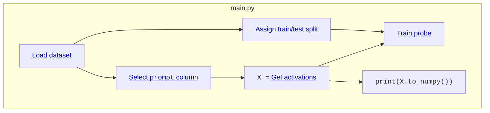

# Use `krnel-graph` to build custom guardrails by "reading the mind of the model"
- **Point of contact:** Kimmy Wilber `<kimmy@krnel.ai>` and Peyman Faratin `<peyman@krnel.ai>`, questions&comments welcome!
- **Date:** 2025 October
- **Intended audience of this guide** is twofold:
   1. Agent developers who want to build LLM applications,
   2. Mechanistic interpretability researchers who want a lightweight way of quickly running experiments.

---

## Introduction

*LLMs are hard to control!*
If you're building a tool that relies on LLMs or agents, how can you be sure that it won't [go off the rails?](https://www.npr.org/2025/07/09/nx-s1-5462609/grok-elon-musk-antisemitic-racist-content) How can you make sure your users' data [doesn't get hacked](https://www.cybersecuritydive.com/news/research-shows-ai-agents-are-highly-vulnerable-to-hijacking-attacks/757319/)?
Ensuring the safety of LLMs requires a novel approach, but right now, there are very few safety tools available to users who want to align the behavior of their models:
1. Rely on the **frontier LLM training labs** to do [safety alignment](https://openai.com/index/detecting-and-reducing-scheming-in-ai-models/) for you
2. Use a separate **guardrail model** like [LlamaGuard 4](https://github.com/meta-llama/PurpleLlama/tree/main/Llama-Guard4) from Meta, [LLM Guard](https://github.com/protectai/llm-guard) from ProtectAI, or [NemoGuard](https://huggingface.co/nvidia/llama-3.1-nemoguard-8b-content-safety) from NVidia.


### Conventional guardrails

Conventional guardrails involve a user and two separate LLM models: the *conversational model* that's having the conversation (like ChatGPT or Claude), and a *separate guardrail model* (like LlamaGuard) which views a copy of the conversation and decides whether each message is safe or unsafe. The guardrail model gets to control the conversation: Messages that are safe pass through, and messages that are unsafe are stopped or sanitized by the application.


In this case,
- The guardrail model **lives separately**, doubling GPU and infrastructure requirements. The latest version of LlamaGuard uses a 12B model, but Llama 3 comes in 1B and 8B variants.
- The guardrail model **adds latency**, because each message of the conversation needs to travel to two models. Running both models in parallel helps, but latency is still defined by the slowest model.
- The guardrail model is **hard to configure.** Typical guardrails are trained to classify [a fixed taxonomy of hazard categories](https://huggingface.co/meta-llama/Llama-Guard-4-12B#hazard-taxonomy-and-policy). If you want to add a different policy to the list, you can add it to its system prompt, but it hasn't been trained on your policy, so you need to measure that your changes help.
- The guardrail model **has a fixed sensitivity,** so you can't adjust the tradeoff between precision and recall. For example, if you want the model to give lower false alarms at the cost of allowing more objectionable content, there's no way to configure it to be less sensitive.

### A better approach: Linear probe-based guardrails

The field of mechanistic interpretability offers another approach: **What if we could read the mind of the model** and use that information to decide whether the conversation is safe?


To do this, we feed the conversation through the model as before to get an output token. However, while it's running, we capture the activations from the [residual stream](https://www.lesswrong.com/posts/utBXFnrDoWdF6cBxf/exploring-the-residual-stream-of-transformers-for), right after one of the layers. We then send this through a simple classifier, like a [support vector machine](https://scikit-learn.org/stable/modules/svm.html), a decision tree, or linear regression.

This approach has a number of benefits:
- It's **flexible** and **accurate**, because you're training the guardrail yourself on your own data
- It **doesn't add latency** to your conversations and **doesn't add extra compute requirements** beyond the conversational model, because the classifier is lightweight and can run instantly on the CPU.

However, there are some tradeoffs:
- You need to pick which data to train on
- You need to collect activations for this dataset

Today, we'll build a custom linear probe-based guardrail using a custom dataset. Then, we'll compare its accuracy to LlamaGuard.
To keep track of our experiment, inputs, and outputs, we'll use the [`krnel-graph` library](https://github.com/krnel-ai/krnel-graph), which handles the LLM and modeling machinery while giving us automatic caching and data provenance.

This demonstration is an offline (batch) evaluation only. **For real-time monitoring**, including low-latency runtime integrations with Ollama, VLLM, HuggingFace, etc, give us a call at `info@krnel.ai`!

## Data

There are many datasets for AI safety and content policy.
We need datasets that are open-source, that include a contrasting mix of safe and unsafe examples, are similar to ordinary conversations / user requests.

Here are the datasets we will combine for this guide:

- [**Alpaca, from Tatsu Lab**](https://huggingface.co/datasets/tatsu-lab/alpaca), containing 52,000 safe prompts for various tasks
- [**BabelScape Alert** and **Alert-Advanced**](https://huggingface.co/datasets/Babelscape/ALERT), containing 45,000 unsafe prompts from a [taxonomy of categories](https://arxiv.org/abs/2404.08676) including hate speech, criminal planning, controlled substances, sexual content, self-harm, and weapons
- [**In-the-Wild Jailbreak Prompts from TrustAIRLab**](https://huggingface.co/datasets/TrustAIRLab/in-the-wild-jailbreak-prompts), a (somewhat noisy) containing >15,000 jailbreak and non-jailbreak prompts
- [**SorryBench**](https://huggingface.co/sorry-bench), with 9,400 unsafe prompts drawn from 44 fine-grained categories (2024 June version)
- [**SteeringToxic from Undi95**](https://huggingface.co/datasets/Undi95/orthogonal-activation-steering-TOXIC), which has 7,300 unsafe prompts
- [**AdvBench from WalledAI**](https://huggingface.co/datasets/walledai/AdvBench), with 520 harmful behaviors
- [**Many Shot Jailbreaking by Vulkan Kutal**](https://github.com/KutalVolkan/many-shot-jailbreaking-dataset/), with 266 jailbreaks
- [**GPTFUZZER from Jiahao Yu et al**](https://github.com/sherdencooper/GPTFuzz) with 100 unsafe prompts


### Set up your environment

Follow these steps on a Linux or macOS system. For Windows, you can use WSL or follow along in the native command line.

1. **Download and install `uv`** from [Astral's installation page](https://docs.astral.sh/uv/getting-started/installation/#installation-methods).
    - `uv` manages python versions, environments, and dependencies for you in self-contained isolated environments, so there's no risk of breaking your system.
    - You can use another python package manager like `pip` or `conda`, but you'll need to change all the examples. *We use uv for development.* If you use your own Python, make sure it is at least version 3.10.

2. **Make a new folder** for this project. You can either clone this repository and play in this example folder, or create a fresh workspace:
    ```shell
    $ cd /tmp
    $ mkdir guardrail_comparison
    $ cd guardrail_comparison
    $ uv init --name guardrail_comparison
    ```
    Install dependencies into this project folder:
    ```shell
    $ uv add krnel-graph[ml,viz] huggingface-hub jupyterlab duckdb
    ```
    If you cloned this example repository, the dependencies are already in this folder's [`pyproject.toml`](./pyproject.toml).

3. **Log into your HuggingFace account** on the website and copy your [access token](https://huggingface.co/settings/tokens) into the HuggingFace CLI:
    ```shell
    $ uv run hf auth login
    ```

4. **Request access to [SorryBench](https://huggingface.co/datasets/sorry-bench/sorry-bench-202406)**. If you want to run without waiting for approval, you can comment the relevant lines from `make_data.py`, but your results will differ somewhat from ours.

### Preparing the data

**Run our data preparation script** to download the data:
```shell
$ uv run make_data.py
```

This should only take 30 seconds or so.  You should see output like the following:

```
Downloading datasets... (takes ~30 sec)

Row counts:
Source                        Safe?  Expected     Actual
----------------------------------------------------------------------
GPTFuzz                           1       100        100 ✅ OK
advbench                          1       520        520 ✅ OK
babelscape_alert                  1     14092      14092 ✅ OK
babelscape_alert_adv              1     30771      30771 ✅ OK
jailbreak_llms                    0      9638       9638 ✅ OK
jailbreak_llms                    1     19738      19738 ✅ OK
many-shot-jailbreaking            1       266        266 ✅ OK
sorrybench                        1      9439       9439 ✅ OK
steering-toxic                    1      7377       7377 ✅ OK
tatsu-lab-alpaca                  0     52001      52001 ✅ OK
```

The resulting dataset should contain 143,942 rows from these 9 datasets.

<details>
<summary><strong>Having trouble?</strong></summary>

- **Mismatches** can happen if the original data has changed since this guide was written. This can cause your results to differ from ours, but this isn't generally a large problem unless you're missing one of the larger datasets.

- **Unable to connect to URL**: If you see an error like `_duckdb.HTTPException: HTTP Error: Unable to connect to URL "hf://...": 401 (Unauthorized).`, you need to log in to HuggingFace with `uv run hf auth login`. You may also need to request access on HuggingFace if the dataset is gated.
If all else fails, comment out the relevant lines from `make_data.py` and run without those datasets.
</details>

## Gathering activations and training linear probes
We can run the LLM, collect activations, and train probes using the `krnel-graph` framework. To do this, start by instantiating a `Runner` object in a file called `main.py`:

```python
#!/usr/bin/env -S uv run
import krnel.graph as kg
runner = kg.Runner()
```
The dataset has three columns: a [text column](https://krnel-graph.readthedocs.io/en/latest/types.html#textcolumntype-quick-reference) called "prompt", a [boolean column](https://krnel-graph.readthedocs.io/en/latest/types.html#krnel.graph.types.BooleanColumnType) called "harmful" acting as our classification target, and a [categorical column](https://krnel-graph.readthedocs.io/en/latest/types.html#categoricalcolumntype-quick-reference) named "source" that captures which dataset the input came from.
```python
# Load the dataset from a local parquet file
ds = runner.from_parquet("dataset.parquet")
ds = ds.take(skip=10) # sample a tenth of the dataset

# Dataset columns
col_text    = ds.col_text("prompt")
col_harmful = ds.col_boolean("harmful")
col_source  = ds.col_categorical("source")

# Define a train/test split
col_split = ds.assign_train_test_split()
```
Columns can come from the dataset or can be an output from other operations. For example, `assign_train_test_split` creates a [`AssignTrainTestSplitOp`](https://krnel-graph.readthedocs.io/en/latest/mech-interp/index.html#krnel.graph.dataset_ops.AssignTrainTestSplitOp), which defaults to holding 25% of the data as a test split (see [docs](https://krnel-graph.readthedocs.io/en/latest/types.html#krnel.graph.types.DatasetType.assign_train_test_split)). If there were a train/test split column inside the data already, we could have used [`ds.col_train_test_split("split")`](https://krnel-graph.readthedocs.io/en/latest/types.html#krnel.graph.types.DatasetType.col_train_test_split) instead.

From there, we can extract the last layer activations of `Llama 2 7B-chat-hf` on each of these prompts and train a probe on the training set using logistic regression that attempts to predict the `harmful` label:
```python
# Extract activations
X = col_text.llm_layer_activations(
    model_name="hf:meta-llama/Llama-2-7b-chat-hf",
    layer_num=-1,      # last layer
    token_mode="last", # last token
    batch_size=4,      # tweak for your hardware
    max_length=2048,   # truncate prompts longer than this many tokens
    dtype="float16",
)

# Train a linear probe
probe = X.train_classifier(
    "logistic_regression",
    positives=col_harmful,        # classification target
    train_domain=col_split.train, # which samples to train on
    preprocessing="standardize",
    params={"C": 0.01},
)
```

Now, save the above in `main.py` and run it:
```shell
$ uv run main.py
```
and.... nothing happens! You've defined *what* steps to take, but you haven't actually *run* them yet.  To actually materialize the graph, we need to call `.to_numpy()` on the result we want, like this:
```python
if __name__ == "__main__":
    print("Activations:")
    print(X.to_numpy())
    print(X.to_numpy().shape)
```
This script should take about ten minutes to run on good hardware. Almost all of that time comes from running the Llama model itself. Afterwards, the output activations are printed to the console:
```
Activations:
[[-0.4116 -3.61    2.607  ... -2.186  -1.043   0.7437]
 [-0.1288  0.2725  1.552  ... -2.17   -0.1768  1.308 ]
 [ 0.9307  2.457   2.447  ... -0.7065  1.142  -1.782 ]
 ...
 [-0.2417  0.782   1.974  ... -2.82    1.614   1.17  ]
 [-0.2551  1.2705  1.208  ... -1.4795  0.374   0.9097]
 [-0.9517  0.0992  1.5    ... -1.579   1.707   1.213 ]]
(1440, 4096)
```

<details>
<summary><strong>Having trouble?</strong></summary>
- **I get a "CUDA out of memory" error!**
    1. Try to lower `batch_size` to 1.
    2. Try a smaller model, like `"hf:meta-llama/Llama-3.2-1B-Instruct"`
- **It's taking forever!**
    1. Subsample the dataset. Change
       ```python
       ds = runner.from_parquet("dataset.parquet")
       ds = ds.take(skip=10)
       ```
       to
       ```python
       ds = runner.from_parquet("dataset.parquet")
       ds = ds.take(skip=100)
       ```
       This will 1/100th of the dataset.
    2. Check your GPU hardware.  If you run `nvidia-smi`, you should see GPU usage while the script is running. Llama2-7b requires a GPU with at least 20GB VRAM. You can also use a smaller model, like `"hf:meta-llama/Llama-3.2-1B-Instruct"`. We tested llama2-7b on:
        - a 32GB Apple Macbook Pro with Apple Silicon (M1 Max, ca. 2021) via the `mps` device
        - a GCP instance running Ubuntu with an NVidia A100 40GB via the `cuda` device
</details>


## Wait, what's `krnel-graph`?
Krnel-graph is a lightweight computation graph library for mechanistic interpretability researchers that makes it easy to fully specify experiments.

With `krnel-graph`, you write your code declaratively, like:
```python
import krnel.graph
ds = krnel.graph.Runner().from_parquet("...")
probe = (ds
    .col_text("prompt")
    .llm_layer_activations(...)
    .train_probe(...,
        positives=ds.col_boolean("harmful"),
        train_domain=ds.assign_train_test_split()
    )
)
```
This creates a computation graph that is lazily executed when you need it.

Using krnel-graph in this way requires a shift in thinking, but there are several advantages:
- **You get caching for free.** There were two calls to `X.to_numpy()`, but it only ran once. Each operation's cache key takes all of its inputs and parameters into account, so you can change parameters or architectures without worrying about overwriting results or using stale values.
- **Strongly-typed computation graphs catch more problems at import time and work better with your tooling** like agents, type inference, or editor autocompletion. Open `main.py` in VSCode and put the caret after `col_text.`, then press tab. You'll see the palette of operations you can perform on text columns.
- **No configuration or extra tools needed.** krnel-graph doesn't need to be configured and can run right in your notebook or laptop. You can (optionally) run `uv run krnel-graph config` to change where intermediate results get saved (S3, etc).
  - 👉 The defaults are lightweight, but `krnel-graph` is more than capable of integrating with your favorite dataflow orchestration library at cloud scale. See the [docs](krnel-graph.readthedocs.io) to get started.
- **It gently encourages best practices around experiment keeping.** The preferred pattern is to keep the main copy of your experiment in `main.py`. Derived experiments, grid searches, different models, and other graph substitutions can live in external files that `import main` .
    - *Suggested pattern:* Main experiment prototype/exemplar lives in `main.py`. Other experiments and derivatives live in other files and `import main` and build on top of parts of the existing graph using [`.subs()`](https://krnel-graph.readthedocs.io/en/latest/graph-specification.html#krnel.graph.op_spec.OpSpec.subs)
      - Imperative code in `main.py` should be guarded by `if __name__ == "__main__"`
      - *👉 Don't worry about output filenames like `layer_23_activations.final.2-DONOTUSE-final.parquet`*. Each output in the cache is keyed by a unique hash of the subgraph that generated that output, so knowing an operation's dependencies and parameters is necessary and sufficient to guarantee its uniqueness in the cache.
      - *👉 Team use*: If you have several reseacrhers working in the same project, keep `main.py` in source control and use a shared cache location on S3. Now you can re-use other teammates' results without having to recompute them!
    - For an example of this pattern, see [`grid_search.py`](./grid_search.py) or [`additional_llamaguards.py`](./additional_llamaguards.py)
    - Notebooks benefit greatly from this `import main` pattern because the graph is lazily defined, so you can have a cluster of GPU machines execute the graph, then use a small notebook on your laptop to interactively view results or plan your next run.

## Evaluation
How well does our probe perform?
```python
probe_result = probe.predict(X).evaluate(
    gt_positives=col_harmful,
    split=col_split,
    score_threshold=0.0,
)

if __name__ == "__main__":
    print("\n\nResults on TEST SET:")
    print(probe_result.to_json()['test'])
```

---

(TODO BELOW)

## LlamaGuard

- how to get token IDs

## What about runtime?
- Want low-latency runtime integrations with Ollama, VLLM, HuggingFace, etc? **We can help you with that!** Give us a call at `info@krnel.ai`